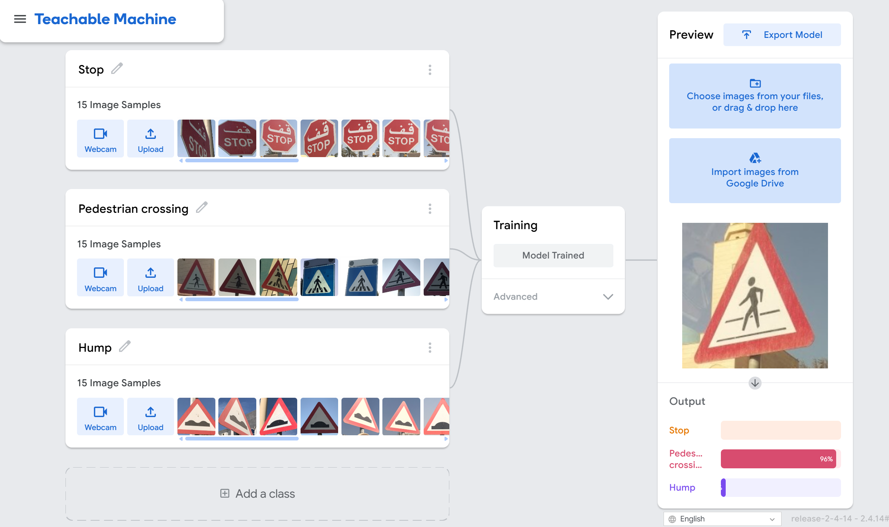

# Road Sign Classification Model
 
A simple image classification model that recognizes three types of road signs: **Stop**, **Pedestrian Crossing**, and **Hump**.
 
## Overview
 
This project uses a Keras-based image classification model trained with [Google's Teachable Machine](https://teachablemachine.withgoogle.com/) (Image Project) to identify road signs from photos. The model was trained by uploading example images for each of the three sign classes, then exported as a Keras (`.h5`) model for use outside the Teachable Machine interface.
 
## Classes
 
| Index | Class |
|-------|-------------------|
| 0 | Stop |
| 1 | Pedestrian crossing |
| 2 | Hump |
 
## How It Was Made
 
1. **Data collection** — Images of Stop, Pedestrian Crossing, and Hump road signs were gathered as training examples. For this project 15 images for each claas were used. 
2. **Training** — The images were uploaded to Teachable Machine's Image Project, where the model was trained to classify the three sign categories.
   
3. **Export** — The trained model was exported in Keras format, producing two files:
   - `keras_model.h5` — the trained model weights and architecture
   - `labels.txt` — the class labels corresponding to the model's output indices
4. **Testing** — The exported model was tested in Google Colab using the `rsmodel.py` script, which loads the model, preprocesses a sample image, and runs a prediction.
## Files
 
- `keras_model.h5` — Trained Keras model exported from Teachable Machine
- `labels.txt` — Class label mapping
- `rsmodel.py` — Python script to load the model and classify a sample image
- `pedestrian_crossing-28288.JPG` — Example test image used to validate the model
